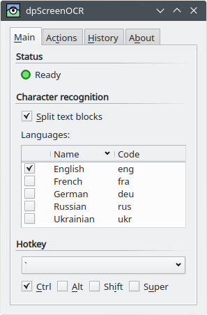
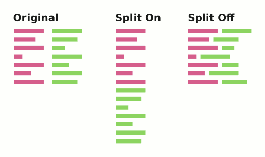

[dpScreenOCR website]: https://danpla.github.io/dpscreenocr
[Language packs]: https://danpla.github.io/dpscreenocr/languages

# About dpScreenOCR

dpScreenOCR is a program to recognize text on screen. Powered by
[Tesseract][], it supports more than 100 languages and can split
independent text blocks, e.g. columns. dpScreenOCR is free and open
source software that works on Windows and Unix-like systems with X11.

[Tesseract]: https://en.wikipedia.org/wiki/Tesseract_(software)

# Installation

## Installing dpScreenOCR

### Windows

The [dpScreenOCR website][] provides an installer and a ZIP archive.
The latter doesn't need installation: unpack it anywhere you want and
run `dpscreenocr.exe`.

### Unix-like systems

The [dpScreenOCR website][] provides several download options,
including repositories and packages for Debian, Ubuntu, and derivative
systems. Downloads for other systems may be added later.

If you don't find a suitable choice for your system, download the
source code tarball, unpack it anywhere, and follow the instructions
in the `doc/building-unix.txt` file.

## Installing languages

### Windows

dpScreenOCR for Windows is shipped with the English language pack.
To install other languages, visit the [Languages][Language packs]
page, download `.traineddata` files you want, and place them in the
`tessdata` directory located in the same folder as the dpScreenOCR
executable.

You can also download languages from other places, but make sure they
are intended for Tesseract 4.0. An attempt to use data designed for
another Tesseract version will cause dpScreenOCR to crash.

### Unix-like systems

Use your package manager to install language packs for Tesseract. The
package names may vary slightly across systems, but they usually start
with "tesseract" and end with a language code or name. For example,
the package for German have the following names:

 * `tesseract-ocr-deu` on Debian, Ubuntu, and derivatives
 * `tesseract-data-deu` on Arch Linux
 * `tesseract-langpack-deu` on Fedora
 * `tesseract-ocr-traineddata-german` on openSUSE

Be aware that on some systems (like Fedora) English is a part of the
main `tesseract` package.

There are also two special packs that provide extra features rather
than languages: `osd` (automatic script and orientation detection) and
`equ` (math and equation detection). dpScreenOCR doesn't use them.

# Usage

## Overview

dpScreenOCR is simple to use:

 1. Choose some languages in the [Main tab].
 2. Move the mouse pointer near the screen area containing text and
    press the hotkey shown in the [Main tab] to start the selection.
 4. Move the mouse so that the selection covers the text and press the
    hotkey again.

After these steps, dpScreenOCR will recognize the text from the
selected area and process it according to the actions from the
[Actions tab].

## Main tab

### Status

The status shows the state of dpScreenOCR:

 *  Green: The program is ready to use. You can press the [hotkey] to
    start a new selection.

 *  Yellow: The program recognizes text. This status text will show
    you the progress.

 *  Red: The program needs some setup. There may be three reasons:

    *  No languages are available. Please install some language packs
       for Tesseract as described in the "[Installing languages]"
       section and restart dpScreenOCR.

    *  No languages are selected. You need to select at least one
       language in the language list.

    *  No actions are selected. You need to select at least one action
       in the [Actions tab].

The yellow and red status messages are also displayed in the title of
the dpScreenOCR's window.

### Character recognition

Options in this section control how dpScreenOCR will recognize text.

#### Split text blocks

If this option is enabled, dpScreenOCR will try to detect and split
independent text blocks, e.g. columns. This behavior is best described
by the following picture:

#### Languages

The language list shows all available language packs that dpScreenOCR
can use to recognize text. You can choose more than one language, but
be aware that this may slow down recognition and reduce its accuracy.

If you want to install more language packs, read the
"[Installing languages]" section.

### Hotkey

The hotkey is used to start and end the on-screen selection. The
default is Control + Grave accent. To cancel the selection, press
Escape.

The hotkey is global: it works even if dpScreenOCR's window is
minimized. If pressing the hotkey has no effect, it probably means
that another program is already using it. In this case, try to choose
a different key combination.

## Actions tab

The Actions tab allows you to choose what dpScreenOCR will do with the
recognized text.

### Copy text to clipboard

This action will copy the text to the clipboard.

### Add text to history

This action will add the text to the history located in the
[History tab]. You can later save the history to a file in plain text,
HTML, or JSON format.

### Run executable

This action will run an executable with the recognized text as the
first argument. The "Run executable" entry expects either an absolute
path to the executable, or just its name in case it's located in one
of the paths of your `PATH` environment variable.

#### Using dpScreenOCR with [GoldenDict][]

Point "Run executable" to the path of the GoldenDict's executable (or
just its name on Unix-like platforms) and make sure GoldenDict is
running. This way GoldenDict will receive the text from dpScreenOCR
and show it in a pop-up window.

[GoldenDict]: https://en.wikipedia.org/wiki/GoldenDict

#### Running scripts on Windows

##### Batch files

dpScreenOCR doesn't run batch files (".bat" or ".cmd") for security
reasons. Please use Python or any other scripting language instead.

##### Creating file associations

Before using a script, make sure that the file association is
configured correctly so that you can launch the script just by its
file name, without mentioning the interpreter explicitly. The simplest
way to test this is to type the name of the script with some
command-line arguments in `cmd.exe`. If the script runs and receives
all arguments, you can skip this section.

We will use Python as an example, but for other languages the process
is similar. Open `cmd.exe` as administrator and run:

    C:\>assoc .py

  * If the association doesn't exist, create a new one:

        C:\>assoc .py=Python.File
        C:\>ftype Python.File=Python.File="C:\Windows\py.exe" "%L" %*

  * If the association exists (`assoc` prints something like
    `.py=Python.File`), run `ftype` to see what command is used:

        C:\>ftype Python.File
        Python.File="C:\Windows\py.exe" "%L" %*

    If the command doesn't end with `%*`, fix it:

        C:\>ftype Python.File=Python.File="C:\Windows\py.exe" "%L" %*

If the script still receives only one argument (path to the script),
this means that Windows actually use a different association for the
given extension and ignores the one set with `assoc/ftype`. To fix
that, open `regedit` and make sure the values of the following keys
end with `%*`:

    HKEY_CLASSES_ROOT\Applications\python.exe\shell\open\command
    HKEY_CLASSES_ROOT\py_auto_file\shell\open\command

A special tip for Python users: note that in the examples above the
association uses Python Launcher (`py.exe`) rather than a concrete
Python executable (`python.exe`). This allows using Unix-style
[shebang][] lines to select the Python version on per-script basis.
For more information, read [Using Python on Windows][].

[Using Python on Windows]: https://docs.python.org/3/using/windows.html

##### Hiding console window

Almost all scripting language interpreters for Windows are shipped
with a special version of the executable that doesn't show the console
window. For example, it's `pythonw.exe` for Python and `wperl.exe` for
Perl.

A special file association is usually added during installation, so
you can hide the console window by simply changing the extension of
the script. For example, Python scripts with `.pyw` extension are
associated with `pythonw.exe` instead of `python.exe`. Other languages
have their own conventions, like `.wpl` for Perl (`wperl.exe`), `.rbw`
for Ruby (`rubyw.exe`), `.wlua` for Lua (`wlua.exe`), etc.  If such an
association does not exist, you can create it manually as described in
the previous section.

#### Running scripts on Unix-like systems

Before using your script, make sure it starts with a proper
[shebang][] and you have execute permission (run
`chmod u+x your_script...`).

Here is an example Unix shell script that translates the recognized
text to your native language using [Translate Shell][], appends both
original and translation to the `translations.txt` file in your home
directory, and displays the translation as a desktop notification.

    #!/bin/sh

    TR=$(trans -b "$1")

    printf "> Original\n\n%s\n" "$1" >> ~/translations.txt
    printf "> Translated\n\n%s\n\n\n" "$TR" >> ~/translations.txt

    notify-send "Translation" "$TR"

[Shebang]: https://en.wikipedia.org/wiki/Shebang_(Unix)
[Translate Shell]: https://www.soimort.org/translate-shell/

## History tab

The History tab shows the history of recognized texts. A text is only
added here if the corresponding action is enabled in the
[Actions tab]. Every text in the list has a timestamp taken at the
moment you finish the selection.

You can save the history to a file in plain text, HTML, or JSON
format.

## Notification area icon

dpScreenOcr has an icon in the notification area. You can toggle
visibility of the window either from the icon's context menu or by
activating the icon (left or middle mouse click, depending on the
platform).

# Tweaking

This section is intended for advanced users and developers. It
describes how to change some settings that are not available in the
dpScreenOCR's interface.

dpScreenOCR saves settings in the `settings.cfg` file. Depending on
the platform, you can find it in the following directories:

 *  Windows:

    * Vista and newer: `%LOCALAPPDATA%\dpscreenocr`
    * XP: `%USERPROFILE%\Local Settings\Application Data\dpscreenocr`

    The strings within `%` are standard environment variables. You can
    copy these paths directly to the folder address bar of Explorer to
    open them.

 *  Unix-like systems: `~/.config/dpscreenocr`

You can modify the file with any text editor. To reset an option to
the default value, remove it from the file; to reset all options,
clear the file or delete it. Be aware that dpScreenOCR rewrites
settings on exit, so make sure you close the program before making
changes.

An option value can be one of the following types:

 *  String - an arbitrary sequence of characters, like a file path.

    If the string should have leading or trailing whitespace, enclose
    it in double quotes. Obviously, quoting is also necessary if the
    string actually starts and ends with a double quote.

    Strings can contain the following escape sequences:

      * `\b` - backspace
      * `\f` - form feed
      * `\n` - line feed
      * `\r` - carriage return
      * `\t` - tabulation
      * `\\` - backslash

    Escaping tabulation is optional. Escaping the backslash is
    optional too, unless the backslash and the next character create
    one of the escape sequences.

 *  Boolean: `true` or `false`.

 *  Number, like `10` or `-5`.

Here is the list of all options that can only be changed by editing
the settings file:

 *  `action_copy_to_clipboard_text_separator` (`\n\n` by default)
    specify the separator for multiple texts for "Copy text to
    clipboard" action. This option only has effect if
    `ocr_allow_queuing` is enabled.

    Keep in mind that every text, if not empty, ends with a newline.

 *  `action_run_executable_wait_to_complete` (`true` by default)
    whether to wait for the executable to complete.

    If this option is disabled, several instances of the executable
    can run simultaneously.

 *  `hotkey_cancel_selection` (`Escape` by default) - hotkey to cancel
    selection.

 *  `ocr_allow_queuing` (`true` by default) allows to queue a new
    selection for recognition without waiting for the previous one to
    complete.

    If this option is enabled, "Copy text to clipboard" action may
    receive more than one text at a time, in which case texts will be
    joined together using `action_copy_to_clipboard_text_separator`.

    If this option is disabled, pressing the hotkey will have no
    effect until the recognition is done. This guarantees that the
    clipboard will receive exactly one text.

 *  `ocr_dump_debug_image` (`false` by default) dump the image passed
    to Tesseract as `dpso_debug.pgm` to the current working directory.

 *  `ui_native_file_dialogs` (`true` by default) use file dialogs
    native to your platform instead of the ones specific to the GUI
    framework.

 *  `ui_tray_icon_visible` (`true` by default) whether to show an icon
    in the notification area.

# Troubleshooting

This section contains the list of common issues and solutions to them.
If the solutions don't help, or you have an issue that is not listed
here, please report the problem on the [issue tracker][].

[Issue tracker]: https://github.com/danpla/dpscreenocr/issues

 *  **The recognized text contains garbage**

    Make sure that you use the minimal set of [languages] needed to
    recognize the text. Don't enable languages just in case: this will
    dramatically reduce the accuracy of recognition.

 *  **Pressing the [hotkey] has no effect**

    * This hotkey is probably used by another program. Try to choose
      another key combination.

    * (Unix) Are you using Wayland? It's not yet supported. If
      possible, switch to X11 session.

 *  **Texts are not added to the history**

    Make sure that "[Add text to history]" is enabled in the
    [Actions tab].

 *  **"Run executable" has no effect**

    * Make sure that the "Run executable" entry contains either an
      absolute path to the executable, or just the name of the
      executable that resides in one of the paths of the `PATH`
      environment variable.

    * (Windows) Are you trying to use a batch file (".bat" or ".cmd")?
      This is not allowed for security reasons. Please use Python or
      another scripting language instead.

    * (Unix) Make sure you have execute permission. Run
      `chmod u+x executable...`.

    * (Unix) If your executable is a script, make sure it starts with
      a proper [shebang][].

 *  **"Run executable" hangs dpScreenOCR**

    This happens because dpScreenOCR waits for the executable to exit.
    You can disable waiting with the
    `action_run_executable_wait_to_complete` option as described in
    the "[Tweaking]" section.

 *  **(Windows) "Run executable" opens the script in a text editor
    instead of running it**

    See [Creating file associations].

 *  **(Windows) "Run executable" runs the script without an
    argument**

    See [Creating file associations].
