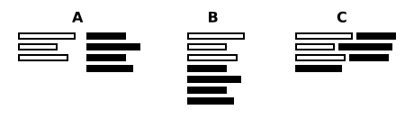

[dpScreenOCR website]: https://danpla.github.io/dpscreenocr
[Language packs]: https://danpla.github.io/dpscreenocr/languages

# About

dpScreenOCR is a free and open-source program to recognize text on the
screen. Powered by [Tesseract][], it supports more than 100 languages
and can split independent text blocks, such as columns.

[Tesseract]: https://en.wikipedia.org/wiki/Tesseract_(software)

# Installation

## Installing dpScreenOCR

### Unix-like systems

The [dpScreenOCR website][] provides several options, including
repositories for Debian, Ubuntu, and derivatives. If you don't find a
suitable choice for your system, download the source code tarball,
unpack it, and follow the instructions in "doc/building-unix.txt".

### Windows

The [dpScreenOCR website][] provides an installer and a ZIP archive.
The latter doesn't need installation: unpack it anywhere and run
dpscreenocr.exe.

## Installing languages

### Unix-like systems

Use your package manager to install languages for Tesseract. Package
names may vary across systems, but they usually start with "tesseract"
and end with a language code or name. For example, the package for
German has the following names:

*   "tesseract-ocr-deu" on Debian, Ubuntu, and derivatives
*   "tesseract-data-deu" on Arch Linux
*   "tesseract-langpack-deu" on Fedora
*   "tesseract-ocr-traineddata-german" on openSUSE

When searching for a language, be aware that some codes are not from
[ISO 639-3][]. In particular, "frk" is German Fraktur rather than
Frankish. The Tesseract developers are aware of this and will
probably fix the code in the future (see issues
[68][tessdata-frk-issue-68], [49][tessdata-frk-issue-49], and
[61][tessdata-frk-issue-61]); meanwhile, if "frk" is described as
"Frankish" in your package manager, you can report the problem to the
package maintainer.

There are also two special packs that provide extra features rather
than languages: "osd" (automatic script and orientation detection) and
"equ" (math and equation detection). dpScreenOCR doesn't use them.

[ISO 639-3]: https://en.wikipedia.org/wiki/ISO_639-3
[tessdata-frk-issue-68]: https://github.com/tesseract-ocr/tessdata_best/issues/68
[tessdata-frk-issue-49]: https://github.com/tesseract-ocr/tessdata/issues/49
[tessdata-frk-issue-61]: https://github.com/tesseract-ocr/langdata/issues/61

### Windows

dpScreenOCR for Windows comes with the English language pack. To
install other languages, use the language manager as described in the
"[Language manager]" section.

Alternatively, you can install languages manually: download the needed
Tesseract language files (for example, from the
[languages page][Language packs]), and place them in the
`C:\Users\(your name)\AppData\Local\dpscreenocr\tesseract_5_data`
folder. To quickly navigate to this folder, press Windows + R to open
"Run" and paste `%LOCALAPPDATA%\dpscreenocr\tesseract_5_data`. You can
also paste this path to the folder address bar of File Explorer.

If the "tesseract_5_data" folder does not exist in
`%LOCALAPPDATA%\dpscreenocr` when you start dpScreenOCR, the program
will copy it from the directory if the EXE file.

#### Migrating from version 1.0

When upgrading from version 1.0, the installer will automatically
migrate languages from the old location, which was the "tessdata"
folder in the directory of the EXE file. To be more specific, the
contents of "tessdata" are copied to the "tesseract_5_data" folder in
the directory of the EXE file, and then each user launching
dpScreenOCR gets their own copy of "tesseract_5_data" in
`%LOCALAPPDATA%\dpscreenocr`.

For the ZIP version, you need to manually copy languages from
"tessdata" to `%LOCALAPPDATA%\dpscreenocr\tesseract_5_data`.

# Usage

dpScreenOCR is simple to use:

1.  Choose languages and actions in the Main tab.
2.  Move the mouse pointer to the screen area containing text and
    press the hotkey shown in the Main tab to start the selection.
3.  Move the mouse so that the selection covers the text and press the
    hotkey again.

After these steps, dpScreenOCR will recognize the text from the
selected area and process it according to the chosen actions.

The rest of this chapter will describe the various settings that you
can find in the Main tab.

## Status

The status describes the current state of dpScreenOCR. Green means the
program is ready to use, and you can press the hotkey to start the
selection. Yellow shows the progress of recognition. Red warns that
the program needs some setup, and you will not be able to start the
selection until the problem is fixed.

## Character recognition

### Split text blocks

If this option is enabled, dpScreenOCR will try to detect and split
independent text blocks, such as columns. Otherwise, everything is
treated as a contiguous block of text. This behavior is best
described by the following picture, which shows a two-column text
layout (A) recognized with (B) and without (C) the "Split text blocks"
option:

Disabling this option will not prevent dpScreenOCR from detecting
paragraphs.

### Languages

This is the list of languages that dpScreenOCR can use to recognize
text. You can choose more than one, but be aware that this may slow
down recognition and reduce its accuracy.

### Language manager

The language manager allows you to install, update, and remove
languages. It is not available on Unix-like systems, where you can
handle languages via the system package manager as described in the
"[Installing languages]" section.

When you open the language manager, it will try to fetch the list of
available languages from the Internet. If it fails (e.g., if there is
no network connection), you can still remove languages in the
corresponding tab.

To install, update, or remove languages, switch to the appropriate
tab, select one or more languages, and press the action button below
the language list. You can also use the filter entry to quickly find
the languages you need; filtering is case-insensitive and applies to
all columns.

## Actions

The Actions group lets you choose what to do with the recognized text:
copy it to the clipboard, add it to the history (located in the
corresponding tab), or pass it as an argument to an executable.

### Run executable

The "Run executable" action will run an executable with the recognized
text as the first argument. The entry expects either an absolute path
to the executable, or just its name in case it's located in one of the
paths listed in your PATH environment variable.

#### Running scripts on Unix-like systems

Before using your script, make sure it starts with a proper
[shebang][] and you have the execute permission (run
`chmod u+x your_script`).

Here is an example Unix shell script that translates the recognized
text to your native language using [Translate Shell][] and displays
the translation as a desktop notification.

    #!/bin/sh

    notify-send "Translation" $(trans -b "$1")

[Shebang]: https://en.wikipedia.org/wiki/Shebang_(Unix)
[Translate Shell]: https://www.soimort.org/translate-shell/

#### Running scripts on Windows

##### Batch files

dpScreenOCR doesn't run batch files (".bat" or ".cmd") because there's
no way to safely pass them arbitrary text. Please use another
scripting language instead.

##### Creating file associations

Before using a script, make sure that the file association is
configured correctly so that you can launch the script just by its
file name, without mentioning the interpreter explicitly. The simplest
way to test this is to type the name of the script with some arguments
in cmd.exe. If the script runs and receives all arguments, you can
skip this section.

We will use Python as an example, but for other languages the process
is similar. Open cmd.exe as administrator and run asscoc with the
extension of the script file as an argument:

    > assoc .py

*   If the association doesn't exist, create a new one:

        > assoc .py=Python.File
        > ftype Python.File="C:\Windows\py.exe" "%L" %*

*   If the association exists (assoc prints something like
    `.py=Python.File`), run ftype to see what command is used:

        > ftype Python.File
        Python.File="C:\Windows\py.exe" "%L" %*

    If the command doesn't end with `%*`, fix it:

        > ftype Python.File="C:\Windows\py.exe" "%L" %*

If the script still receives only one argument (path to the script),
this means that Windows actually use a different association for the
given extension and ignores the one set with assoc/ftype. To fix
this, open regedit and make sure the values of the following keys use
the correct path to the Python executable and end with `%*`:

    HKEY_CLASSES_ROOT\Applications\python.exe\shell\open\command
    HKEY_CLASSES_ROOT\py_auto_file\shell\open\command

A tip for Python users: note that in the examples above the
association uses Python Launcher (py.exe) rather than a concrete
Python executable (python.exe). This allows using [shebang][] lines to
select the Python version for each script. For more information, read
[Using Python on Windows][].

[Using Python on Windows]: https://docs.python.org/3/using/windows.html

##### Hiding console window

Most scripting language interpreters for Windows come with a special
version of the executable that doesn't show the console window. For
example, this is pyw.exe for Python.

The interpreter installer usually adds a special file association that
allows you to hide the console window by changing the script extension
(for example, to ".pyw" for Python). If such an association does not
exist, you can create it as described in the previous section.

## Hotkey

The hotkey starts and ends the on-screen selection. To cancel the
selection, press Escape.

The hotkey is global: it works even if the dpScreenOCR's window is
minimized. If pressing the hotkey has no effect, it probably means
that another program is already using it. In this case, try another
key combination.

# Tweaking

This section describes how to change some settings that are not
available in the dpScreenOCR interface.

dpScreenOCR saves settings in settings.cfg. Depending on the platform,
you can find it in the following directories:

*   Unix-like systems: `~/.config/dpscreenocr`

*   Windows: `%LOCALAPPDATA%\dpscreenocr`

    You can paste this path to the folder address bar of File Explorer
    to open it. `%LOCALAPPDATA%` is an environment variable that
    usually expands to `C:\Users\(your name)\AppData\Local\`

Each line in settings.cfg contains an option as a key-value pair. A
value is a string that, depending on the option, represents a boolean
(`true` or `false`), number (like `10` or `-5`), file path, etc.

Values can contain the following escape sequences:

*   `\n` - line feed
*   `\r` - carriage return
*   `\t` - tabulation

Any other character preceded by `\` is kept as is. To preserve leading
spaces, escape the first one with `\`; to preserve trailing spaces,
put `\` at the end of the line.

To reset an option to the default value, remove it from settings.cfg;
to reset all options, clear or delete the file. Be aware that
dpScreenOCR rewrites settings on exit, so make sure you close the
program before making changes.

Here is a list of options that can only be changed by editing the
settings file:

*   `action_copy_to_clipboard_text_separator` (`\n\n\n` by default)
    the separator to insert between recognized texts when the "Copy
    text to clipboard" action gets several of them at once. This
    option only has effect if `ocr_allow_queuing` is enabled.

*   `history_wrap_words` (`true` by default) whether to break long
    lines of text in the history so that you don't have to scroll
    horizontally.

*   `hotkey_cancel_selection` (`Escape` by default) hotkey to cancel
    selection.

*   `ocr_allow_queuing` (`true` by default) allows you to queue a new
    selection for recognition without waiting for the previous one to
    complete. If this option is disabled, pressing the hotkey will
    have no effect until the recognition is done.

    If this option is enabled, the "Copy text to clipboard" action can
    get several recognized texts at once, in which case they will be
    joined using `action_copy_to_clipboard_text_separator` as a
    separator.

*   `selection_border_width` (`3` by default) width of the selection
    border.

    Depending on the platform, this width can be scaled proportionally
    to DPI, which may be the physical DPI of the display, the virtual
    DPI set via global interface/font scale settings, or a combination
    of both.

*   `ui_tray_icon_visible` (`true` by default) whether to show an icon
    in the notification area.

*   `ui_window_minimize_on_start` (`false` by default) minimize window
    on start.

*   `ui_window_minimize_to_tray` (`false` by default) hide window to
    the notification area on minimizing. This option only has effect
    if `ui_tray_icon_visible` is enabled.

# Troubleshooting

This section contains a list of possible issues and their solutions.
If the solution doesn't help, or you have a problem that is not listed
here, please report it on the [issue tracker][]. You can also contact
the author by email; the link is at the bottom of the
[dpScreenOCR website][].

[Issue tracker]: https://github.com/danpla/dpscreenocr/issues

*   **Recognized text contains garbage**

    Make sure that you use the minimal set of languages needed to
    recognize the text. Don't enable languages just in case: this will
    dramatically reduce the accuracy of recognition.

*   **Pressing the hotkey has no effect**

    This hotkey is probably used by another program. Try to choose
    another key combination.

*   **"Run executable" has no effect**

    * Make sure that the "Run executable" entry contains either an
      absolute path to the executable, or just the name of the
      executable that resides in one of the paths listed in the PATH
      environment variable.

    * (Unix) Make sure you have the execute permission. Run
      `chmod u+x executable`.

    * (Unix) If your executable is a script, make sure it starts with
      a proper [shebang][].

    * (Windows) Are you trying to use a batch file (".bat" or ".cmd")?
      This is not allowed because there is no way to safely pass them
      arbitrary text. Please use another scripting language instead.

*   **(Unix) "Wayland is not supported. Please switch to the X11/Xorg
    session"**

    You need to switch to the X11/Xorg session, as dpScreenOCR doesn't
    work with Wayland yet. On most desktop environments, you can do
    this via a dedicated menu (sometimes hidden under the gear button)
    when the login screen asks for the password.

*   **(Unix) No languages**

    Make sure that the TESSDATA_PREFIX environment variable is either
    not set or points to the directory with ".traineddata" files.

*   **(Windows) "Run executable" opens the script in a text editor**

    Create a file association as described in
    [Creating file associations].

*   **(Windows) "Run executable" runs the script without an
    argument**

    Make sure that the file association ends with `%*`. See
    [Creating file associations] for the details.
